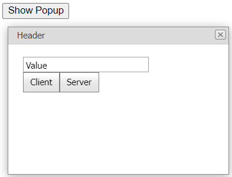

# Popup Control for ASP.NET Web Forms - How to return values from the content page and close the pop-up window on the client or server
<!-- run online -->
**[[Run Online]](https://codecentral.devexpress.com/e3098/)**
<!-- run online end -->

This example demonstrates how to add an editor to the popup control's **ContentUrl** page, get the editor's value, and close a pop-up window on the client or server.



## Overview

On the parent page, create a popup control and specify its [ContentUrl](https://docs.devexpress.com/AspNet/DevExpress.Web.ASPxPopupControlBase.ContentUrl) property. Add an input element to the page and handle its `OnClick` event to invoke a pop-up window.

```aspx
<input id="btnShowPopup" type="button" onclick="OnBtnShowPopupClick();" value="Show Popup" />
<dx:ASPxPopupControl ID="popup" runat="server" ClientInstanceName="popup"
    ContentUrl="~/PopupContent.aspx" .../>
```

On the **ContentUrlPage**, create a text box editor and two buttons. Create the **HidePopupAndShowInfo** function that hides the pop-up window and displays the editor's value in an alert message. You can call that function on the client and server.

```js
function HidePopupAndShowInfo(closedBy, returnValue) {
    popup.Hide();
    alert('Closed By: ' + closedBy + '\nReturn Value: ' + returnValue);
}
```

## Files to Review

* [Default.aspx](./CS/WebSite/Default.aspx) (VB: [Default.aspx](./VB/WebSite/Default.aspx))
* [PopupContent.aspx](./CS/WebSite/PopupContent.aspx) (VB: [PopupContent.aspx](./VB/WebSite/PopupContent.aspx))
* [PopupContent.aspx.cs](./CS/WebSite/PopupContent.aspx.cs) (VB: [PopupContent.aspx.vb](./VB/WebSite/PopupContent.aspx.vb))

## More Examples

* [Popup Control for ASP.NET Web Forms - How to return values from the сontent сollection and close the pop-up window on the client or server](https://github.com/DevExpress-Examples/asp-net-web-forms-popup-control-get-edit-values-and-close-popup-on-client-and-server)
* [Popup Control for ASP.NET Web Forms - How to pass a parameter from the content to parent page](https://github.com/DevExpress-Examples/asp-net-web-forms-popup-control-pass-parameter-from-content-to-parent-page)
* [How to manipulate client-side objects on the popup control's ContentUrl page](https://github.com/DevExpress-Examples/how-to-manipulate-client-side-objects-within-a-aspxpopupcontrol-with-the-specified-contenturl-e3928)
* [Splitter for ASP.NET Web Forms - How to return values from the ContentUrl page](https://github.com/DevExpress-Examples/aspxsplitter-how-to-return-a-value-from-a-page-specified-via-splitterpanecontenturl-e3614)
